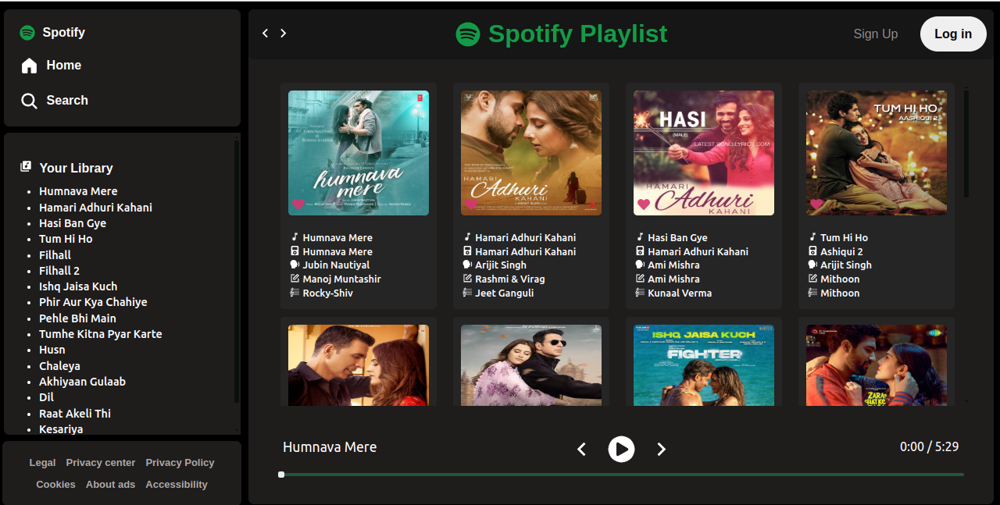

# 🎵 D Music Player 
(Integrated audius Api - "https://api.audius.co/v1/tracks/trending?limit=60&offset=4&app_name=D-Music-Player"
    )

A simple and modern **Music Player** built with **React + Vite**, featuring play/pause, next/previous, and seek functionality.  
Deployed live on **Netlify** 🚀.

---

## 🌐 Live Demo

👉 [Music Player](https://d-music-player-d.netlify.app/)

---

## 📸 Screenshots

---

## ⚡ Features

- 🎶 Play / Pause music
- ⏭️ Next / Previous song
- 📊 Seekbar with progress tracking
- 📱 Responsive design for mobile and desktop
- 🎨 Built with **React + Vite** and styled with **CSS**

---

## 🛠️ Tech Stack

- **Frontend:** React, Vite
- **State Management:** Context API
- **Deployment:** Netlify
